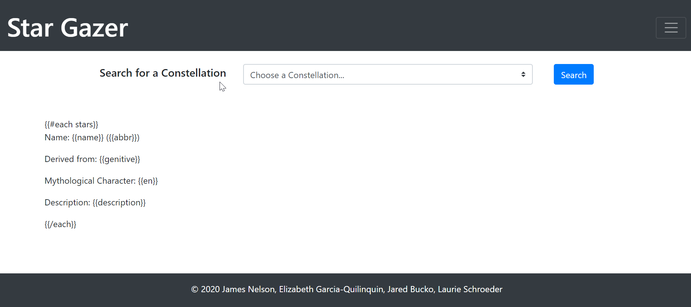

# Star Gazer

2020

### DESCRIPTION

Node based app that allows users to log in and view information about different astrological formations.

[Deployed Link](https://aqueous-dusk-93036.herokuapp.com/)

### INSTALLATION INSTRUCTIONS

    - [Local Setup]

1. Setup the database by inputting your Mysql Workbench user & password in the config.js file, located in the config file, line 3 & 4.
2. Either build the database using Workbench or the CLI with the provided schema.sql in the db folder.
3. Then run the following two commands to migrate the database "npx sequelize-cli db:migrate",then - "npx sequelize-cli db:seed:all".
4. Install the required modules by typing "npm install" or "npm i" in the containing folder using your code editor terminal.
5. Run the app by typing "node app.js" or "node app."
6. If successful, the user will see "connected on localhost:5000," and will be able to click on the link to see the app displayed n their default browser.
7. The user can then either sign up, or log in to see the main content. The user can also log out after they are done.

   - [Deployed Setup]

8. Click on the following Heroku link to see the deployed version. https://aqueous-dusk-93036.herokuapp.com/

### BUILT WITH

- [HTML](https://html.com/)
- [CSS](https://www.w3schools.com/css/)
- [Javascript](https://www.javascript.com/)
- [JQuery](https://jquery.org/)
- [Bootstrap](https://getbootstrap.com/)
- [Font Awesome](https://fontawesome.com/)
- [Node](https://nodejs.org/en/)
- [NPM](https://www.npmjs.com/)
- [MySql Workbench](https://www.mysql.com/products/workbench/)
- [Heroku](https://www.heroku.com/)
- [JawsDB](https://www.jawsdb.com/)
- [Travis-ci](https://travis-ci.org/)

### NODE MODULES USED

- [MySql](https://www.npmjs.com/package/mysql)
- [Express](https://www.npmjs.com/package/express)
- [Body-parser](https://www.npmjs.com/package/body-parser)
- [Eslint-config-prettier](https://www.npmjs.com/package/eslint-config-prettier)
- [Eslint-plugin-prettier](https://www.npmjs.com/package/eslint-plugin-prettier)
- [Express-handlebars](https://www.npmjs.com/package/express-handlebars)
- [prettier](https://www.npmjs.com/package/prettier)
- [mysql2](https://www.npmjs.com/package/mysql2)
- [sequelize](https://www.npmjs.com/package/sequelize)
- [eslint](https://www.npmjs.com/package/eslint)
- [nodemon](https://www.npmjs.com/package/nodemon)

### AUTHOR

- [Github](https://github.com/equilinquin)
- [Github](https://github.com/clauries)
- [Github](https://github.com/jaredbucko)
- [Github](https://github.com/alpinelife37)

MIT License

Copyright (c) [2020][james nelson, elizabeth garcia-quilinquin, jared bucko, laurie schroeder]

Permission is hereby granted, free of charge, to any person obtaining a copy
of this software and associated documentation files (the "Software"), to deal
in the Software without restriction, including without limitation the rights
to use, copy, modify, merge, publish, distribute, sublicense, and/or sell
copies of the Software, and to permit persons to whom the Software is
furnished to do so, subject to the following conditions:

The above copyright notice and this permission notice shall be included in all
copies or substantial portions of the Software.

THE SOFTWARE IS PROVIDED "AS IS", WITHOUT WARRANTY OF ANY KIND, EXPRESS OR
IMPLIED, INCLUDING BUT NOT LIMITED TO THE WARRANTIES OF MERCHANTABILITY,
FITNESS FOR A PARTICULAR PURPOSE AND NONINFRINGEMENT. IN NO EVENT SHALL THE
AUTHORS OR COPYRIGHT HOLDERS BE LIABLE FOR ANY CLAIM, DAMAGES OR OTHER
LIABILITY, WHETHER IN AN ACTION OF CONTRACT, TORT OR OTHERWISE, ARISING FROM,
OUT OF OR IN CONNECTION WITH THE SOFTWARE OR THE USE OR OTHER DEALINGS IN THE
SOFTWARE.
